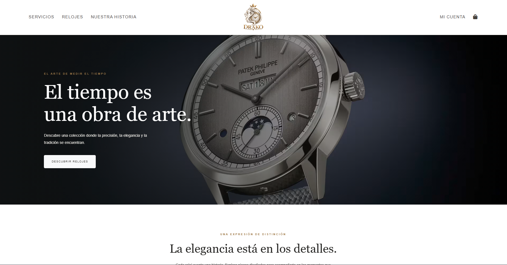

# ¡Hola! Soy Alejo 👋

### Desarrollador Full Stack / Backend | Estudiante de Ingeniería de Sistemas

Soy desarrollador de software en formación, con interés en construir aplicaciones web funcionales, escalables y bien estructuradas. Actualmente curso Ingeniería de Sistemas en la **Universidad Nacional Abierta y a Distancia (UNAD)** y continúo fortaleciendo mis habilidades en desarrollo backend, arquitectura de software y ciberseguridad.

Me gusta aprender construyendo proyectos reales, resolver problemas mediante código y comprender cómo funcionan los sistemas más allá de su interfaz.

- 💻 Enfoque actual: desarrollo **Backend y Full Stack**.
- 🚀 Proyecto destacado: **DRAKO**, una tienda web de relojes.
- 🔐 Aprendiendo ciberseguridad, redes, Linux y seguridad de aplicaciones.
- 📚 Explorando Java, Spring Boot y buenas prácticas de desarrollo.
- 🎯 Objetivo: crecer como desarrollador y construir soluciones de software seguras, mantenibles y eficientes.

---

## 🛠️ Tecnologías y herramientas

### Desarrollo web

### Backend y bases de datos

### Herramientas y entorno de trabajo

---

## 🚀 Proyectos destacados

### ⌚ DRAKO — Tienda web de relojes

Aplicación web de comercio electrónico enfocada en la presentación y comercialización de relojes, con una interfaz elegante y funcionalidades de compra en línea.

**Vista previa del proyecto**

**Tecnologías:** Angular, TypeScript, Node.js, Express.js y MongoDB.

**Funcionalidades principales:**
- Desarrollo de interfaces web y componentes reutilizables.
- Autenticación y gestión de usuarios.
- Consumo de servicios mediante API REST.
- Gestión de productos, imágenes y carrito de compras.
- Separación del frontend y backend.

🔗 [Ver mis repositorios en GitHub](https://github.com/Lulo7)

---

## 🔐 Actualmente aprendiendo

Estoy ampliando mis conocimientos para comprender mejor el desarrollo y la seguridad de las aplicaciones.

- **Redes y protocolos:** TCP/IP, TCP, UDP, DNS y HTTP.
- **Linux:** terminal, administración básica y herramientas de red.
- **Ciberseguridad:** fundamentos de seguridad, análisis de tráfico y seguridad web.
- **Backend con Java:** Java, Spring Boot y desarrollo de API REST.
- **Seguridad de aplicaciones:** OWASP, AppSec y prácticas de desarrollo seguro.

Mi objetivo es integrar el desarrollo de software con la ciberseguridad para construir aplicaciones que no solo funcionen correctamente, sino que también estén diseñadas pensando en la seguridad.

---

## 🎓 Formación

- **Ingeniería de Sistemas** — Universidad Nacional Abierta y a Distancia (UNAD). En curso.
- **Bootcamp Full Stack** — Formación de 400 horas. En curso.
- **Diplomado en Programación Java** — Politécnico de Colombia. 120 horas.

---

## 🤝 Conectemos

Estoy interesado en oportunidades Junior de desarrollo Backend y Full Stack, proyectos colaborativos y espacios donde pueda seguir aprendiendo y aportando.

---

*“El aprendizaje constante transforma los problemas en oportunidades para construir algo mejor.”*
